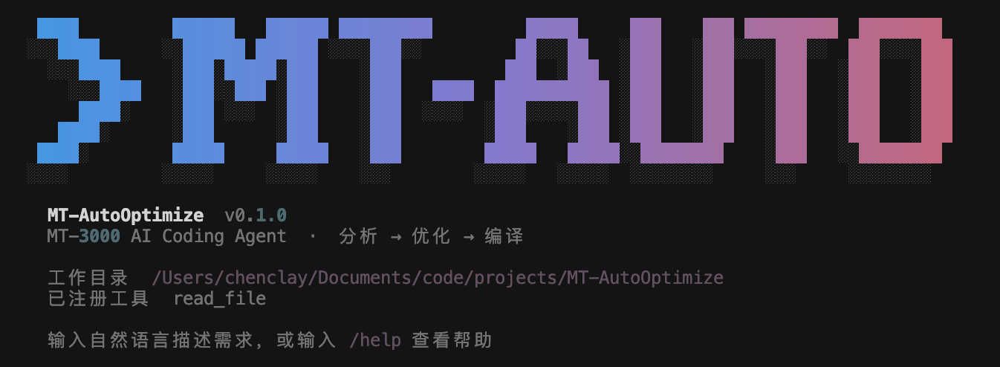

# MT-AutoOptimize



---

Coding Agent for MT-3000

## 项目介绍

主要用LangGraph构建ReAct循环，实现Coding Agent

## 环境配置

使用`uv`来进行环境配置

首先安装好`uv`，自行获取LLM厂商相关的`base url`和`api key`

修改文件`.env.example`的相关字段

```bash
# LLM Configuration
LLM_API_KEY=YOUR_API_KEY
LLM_BASE_URL=https://api.example.com
MODEL_NAME=YOUR_MODEL_NAME
```

然后将此环境配置文件改名为`.env`即可

## 运行方法

先安装好`uv`

```bash
# version 0.1.0
git checkout develop
uv sync
uv run python app.py
```

## 调试方法

用`LangSmith`检查结点运行状态

```bash
uv add --dev langsmith
export LANGSMITH_TRACING=true
export LANGSMITH_API_KEY="ls-your-api-key"
export LANGSMITH_PROJECT="mt-autooptimize"
```

启动项目，运行一次，登陆`LangSmith`的[网站](https://smith.langchain.com)，检查项目运行情况。

## 测试方法

此项目提供`pytest`:

```bash
uv run pytest tests/ -v
```

---