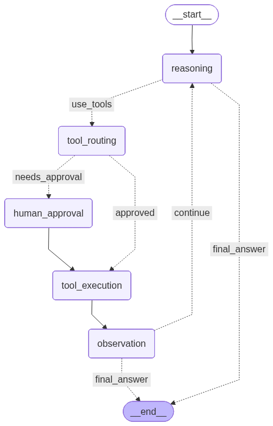

# ReAct Loop for Coding Agent

Coding Agent for MT-3000



---

## 定义状态

```python
class ToolCallInfo(TypedDict):
    """单个工具调用信息"""
    call_id: str
    tool_name: str
    arguments: dict
    status: Literal[
        "pending",
        "awaiting_approval",
        "executing",
        "success",
        "error",
        "cancelled",
    ]
    result: str | None
    error_msg: str | None

class AgentState(TypedDict):
    """ReAct循环中Agent的状态"""
    # 会话历史消息
    message: Annotated[list[BaseMessage], add_messages]

    # 当轮工具调用情况
    pending_tool_calls: list[ToolCallInfo]      # 当前轮待执行的工具调用
    completed_tool_calls: list[ToolCallInfo]    # 当前轮已完成的工具调用

    # 控制流
    turn_count: int                             # 当前轮次
    max_turns: int                              # 最大轮次
    should_continue: bool                       # 是否继续循环
    needs_human_approval: bool                  # 是否需要人工审批
    approval_requests: list[dict]               # 待审批项

    # MT-3000相关
    optimization_mode: str | None               # 优化模式
    source_file: str | None                     # 源文件路径
    compile_results: list[dict]                 # 编译结果历史
    benchmark_results: list[dict]               # 基准测试结果历史
    current_candidates: dict | None             # 当前候选方案

    # Meta information
    working_directory: str                      # 工作目录
    session_id: str                             # 会话ID

```

## 定义结点

* `reasoning`: 推理结点
* `tool_routing`: 路由判断
* `human_approval`: 人工审批
* `tool_execution`: 工具执行
* `observation`: 观察整合结点

### 各结点职责

#### reasoning

调用 LLM 进行推理。组装 system prompt + 消息历史，流式调用 ChatModel，通过 EventBus 实时推送 `CONTENT` / `THOUGHT` 事件。解析响应中的 `tool_calls` 写入 `pending_tool_calls`，无工具调用则视为最终回答，流转至 END。

**路由**: 有 `tool_calls` → `tool_routing` | 无 → `END`

#### tool_routing

按风险策略对每个待执行工具分流。查表 `DEFAULT_TOOL_RISK` 获取风险等级：`low` 自动放行（status 保持 `pending`），`medium` / `high` 标记为 `awaiting_approval` 并加入审批队列。

**路由**: 存在待审批项 → `human_approval` | 全部放行 → `tool_execution`

#### human_approval

通过 LangGraph `interrupt` 暂停图执行，将审批请求交给 CLI 层。CLI 渲染确认对话框，用户逐条决策（批准 / 拒绝）。图恢复后根据决策将工具状态更新为 `pending` 或 `cancelled`。

**流转**: → `tool_execution`

#### tool_execution

遍历 `pending_tool_calls`，跳过 `cancelled` 项，逐个调用 `executor(tool_name, arguments)`。执行过程通过 EventBus 发送 `TOOL_STATE_UPDATE` / `TOOL_CALL_COMPLETE` 事件，结果写入 `completed_tool_calls`。

**流转**: → `observation`

#### observation

将 `completed_tool_calls` 转为 LangChain `ToolMessage` 追加到消息历史，供下一轮 reasoning 参考。清空当前轮工具调用状态，检查是否超过 `max_turns`。

**路由**: 未超限 → `reasoning`（ReAct 循环闭合） | 超限 → `END`


